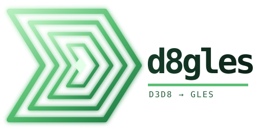
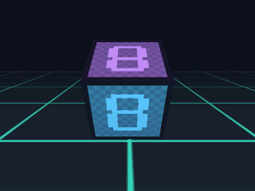
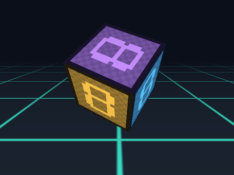

<p align="center"></p>

# d8gles

The Direct3D 8 / D3DX 8 API used by early-2000s game clients, implemented on
OpenGL ES 3.0. Game code keeps calling `IDirect3DDevice8::SetRenderState`,
`SetTextureStageState`, `DrawIndexedPrimitive`, `LockRect` and friends; d8gles
turns them into GL calls and a generated fixed-function shader.

It was split out of the [Metin2 Android port](https://github.com/cemreefe/metin2-android),
where it renders terrain, water, characters, effects and the whole 2D UI.

<p align="center"></p>

The cube above is `examples/spinning_cube.cpp`: plain D3D8 calls, rendered
headlessly on Mesa through EGL. See [Example](#example).

## Layering

```
game / engine code          (D3D8 calls, unchanged)
  d8gles                    this library: API surface + GLES 3.0 backend, no OS code
platform adapter            yours: creates the window + GLES context, installs D8GLES_Platform
OS                          Android (EGL), Linux (EGL), Windows (ANGLE), ...
```

d8gles never creates a window or a context. The platform makes a GLES 3.0 context
current on the render thread, installs its hooks, and then creates the device:

```cpp
#include <d8gles/d8gles.h>

static void Present(void*) { eglSwapBuffers(display, surface); }
static void Log(int level, const char* msg, void*) { fprintf(stderr, "%s\n", msg); }

D8GLES_Platform platform = { Present, Log, nullptr };
D8GLES_SetPlatform(&platform);
IDirect3D8* d3d = Direct3DCreate8(D3D_SDK_VERSION);
IDirect3DDevice8* device;
d3d->CreateDevice(0, D3DDEVTYPE_HAL, hwnd, 0, &params, &device);
```

`IDirect3DDevice8::Present` calls `platform.present`. Everything else is plain GL
on the current context. `D8GLES_SetDebug` turns on flat-shading diagnostics and a
one-frame draw-state dump through `platform.log`.

The Android adapter in the Metin2 port, `clientsource/EterLib/GrpOpenGL.cpp`,
does exactly this: `eglSwapBuffers`, `__android_log_print`, and polls system
properties to drive the debug switches.

## What is implemented

- **Fixed-function pipeline in one shader:** pre-transformed (`XYZRHW`) and
  transformed vertices, world/view/projection, two texture stages with the common
  `D3DTOP_*`/`D3DTA_*` ops and `TFACTOR`, texture coordinate generation and
  texture transforms, per-vertex lighting (two lights, materials and
  material-source states), fog (linear, exp, exp2), alpha test, alpha blending.
- **FVF vertex layouts:** XYZ/XYZRHW, normal, diffuse, specular, up to two sets of
  texture coordinates.
- **Resources:** textures (A8R8G8B8, X8R8G8B8, R5G6B5, X1R5G5B5, A1R5G5B5,
  A4R4G4B4) with `LockRect`/`UnlockRect`, vertex and index buffers (VBO/IBO),
  render-target textures through FBOs, and depth surfaces.
- **Render state:** z test/write, cull mode, blend factors, viewport, clear.
- **D3DX:** the matrix, vector, plane and quaternion helpers the clients use,
  with D3DX semantics (row vectors; the look-at and projection helpers are the
  right-handed `...RH` variants).

Not implemented: programmable vertex/pixel shaders (`CreateVertexShader` returns
a dummy handle), more than two texture stages or lights, volume and cube
textures, compressed texture formats (decode DDS before upload), stencil, fill
mode and scissor states, D3DX mesh generation (`D3DXCreateSphere` returns an
empty mesh), and multithreaded device use.

This list reflects what the Metin2 client needs. Other games will hit gaps; the
debug dump shows which states a draw uses.

## Build

```sh
cmake -S . -B build -DCMAKE_BUILD_TYPE=Release
cmake --build build -j
ctest --test-dir build --output-on-failure    # headless EGL render test (Mesa works)
```

In a CMake project:

```cmake
add_subdirectory(third_party/d8gles)
target_link_libraries(game PRIVATE d8gles::d8gles GLESv3)   # Android; elsewhere GLESv2 + EGL
```

If your project already has its own Win32 type shim (`GUID`, `LARGE_INTEGER`,
...), define `D8GLES_HAVE_WIN32_TYPES` so d8gles doesn't declare them again.

The test (`tests/render_test.cpp`) creates a 64x64 EGL pbuffer, clears it blue,
draws an `XYZRHW | DIFFUSE` triangle through the D3D8 API, and checks the pixels.
It is skipped (exit 77) when no GLES 3 EGL context is available.

## Example

`examples/spinning_cube.cpp` uses only the D3D8 API: a vertex buffer with
`D3DFVF_XYZ | D3DFVF_DIFFUSE | D3DFVF_TEX1`, a texture filled through `LockRect`,
D3DX matrices, a directional light on the floor, and linear fog.

```cpp
dev->CreateTexture(16, 16, 1, 0, D3DFMT_A8R8G8B8, D3DPOOL_MANAGED, &tex);
tex->LockRect(0, &lr, 0, 0);  /* write texels */  tex->UnlockRect(0);

dev->CreateVertexBuffer(36 * sizeof(CubeVertex), 0, CUBE_FVF, D3DPOOL_MANAGED, &vb);
vb->Lock(0, 0, (BYTE**)&v, 0);  /* write vertices */  vb->Unlock();

D3DXMatrixRotationY(&ry, t);
D3DXMatrixMultiply(&world, &ry, &rx);
dev->SetTransform(D3DTS_WORLD, &world);
dev->SetRenderState(D3DRS_FOGTABLEMODE, D3DFOG_LINEAR);
dev->SetTexture(0, tex);
dev->SetStreamSource(0, vb, sizeof(CubeVertex));
dev->SetVertexShader(D3DFVF_XYZ | D3DFVF_DIFFUSE | D3DFVF_TEX1);
dev->DrawPrimitive(D3DPT_TRIANGLELIST, 0, 12);
```

```sh
cmake -S . -B build -DD8GLES_BUILD_EXAMPLES=ON && cmake --build build -j
mkdir -p frames && EGL_PLATFORM=surfaceless build/spinning_cube frames 60
ffmpeg -framerate 20 -i frames/frame_%03d.ppm -vf scale=320:-1 demo.gif
```

Without arguments it renders one frame and checks it; that is the
`spinning_cube` CTest smoke test.



## Provenance

The code started as the OpenGL bridge in
[Bahori35/metin2-android](https://github.com/Bahori35/metin2-android) and was
mostly rewritten during the Android port (fixed-function shader, FBO render
targets, D3DX math, texture formats, the platform hooks). It contains no
Microsoft code; the API names and constants follow the public DirectX 8 SDK
documentation. Direct3D is a trademark of Microsoft; this project is not
affiliated with Microsoft.

The license has not been chosen yet: the upstream bridge was published without
one.
